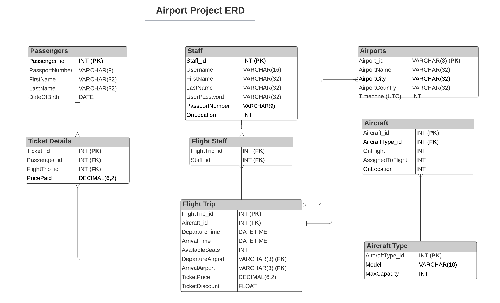

# Airport Project

Created by:
- [Leo Waltmann](https://github.com/ldaijiw)
- [Jared Solano](https://github.com/jaredsparta)
- [Sam Turton](https://github.com/samturton2)
- [Maciej Sokol](https://github.com/mattsokol79) 
- [Ubaid-ir-rehman Muhammad](https://github.com/ubaid97)

## Introduction

In this project we were tasked to design a flight trip booking system for airport staff and create a user-friendly Terminal UI. We were given a list of user stories that outlined the basic requirements for the product, giving staff the ability to:
- create a passenger with basic personal information such as a name and passport number
- create a flight trip with a specific destination
- assign and/or change a plane to a given flight trip
- login to perform any necessary actions
- add passengers to a flight trip, and sell tickets to them
- generate a flight attendees list report to list the passengers' name and passport for a given flight trip

We also added the following features as an increment after delivering the initial product:
- Ability for passengers to log in (once their details have been added to the database) and view available flights, as well as their current flight details (if a booking has been made in their name)
- Encryption of the login details for both staff and passengers in the database
- Added a hierarchy of staff with 2 levels: level 1 having restricted access, and level 2 having unrestricted access to all functions
- Ability for staff level 2 to find total profit made for a given flight trip
- Began a front-web application to create an intuitive way to perform the methods outlined by the initial requirements.

For this project we used the following tools, methods, and languages:
- Python
- SQL
- AWS Relational Database Service (RDS)
- Test Driven Development
- HTML

### Agile and Scrum

As a group we decided to use the Scrum framework to implement Agile, with a focus on the continuous delivery of smaller incremental changes. Rather than planning out the entire week, we created a product backlog outlining the user stories and potential additional features as epic stories and used a scrum board on [trello](https://www.trello.com/en) to track our progress. We planned out daily sprints, starting with sprint planning meetings and ending with sprint retrospectives, which enabled us to be flexible and constantly reassess and reprioritise work if necessary.

## ERD



### Git branching
- create new branch
```git branch <new_branch>```
- switch to new branch
```git checkout <new_branch>```
- add, commit and push your changes to the repo branch
```git push -u origin <new_branch>```
- On github request a merge to main
- Discuss and accept the pull request
- Delete the old branch locally
```git branch -d <branch_to_delete>```

## PYTHON FILES

**create_person.py**
```python
# TABLES: PASSENGER
def create_passenger():
    # INPUT: FIRST NAME, LAST NAME, DOB, PASSPORT NUMBER

    # SQL QUERY TO INPUT INTO PASSENGERS TABLE

    # OUTPUT: SUCCESSFUL MESSAGE

# TABLES: STAFF
def create_staff():
    # INPUT: FIRST NAME, LAST NAME, USERNAME, PASSWORD, PASSPORT NUMBER

    # SQL QUERY TO INPUT INTO STAFF TABLE

    # OUTPUT: SUCCESSFUL MESSAGE
```

**flight_trip_manager.py**
```python
# TABLES: FLIGHT TRIP, AIRPORTS
def create_flight_trip():
    # INPUT: DEPARTURE TIME, DEPARTURE AIRPORT, ARRIVAL AIRPORT, TICKET PRICE, TICKET DISCOUNT

    # ESTIMATE ARRIVAL TIME (1 hour for now)
    
    # RETURN: FLIGHT TRIP ID


# TABLES: FLIGHT TRIP, AIRCRAFT
def assign_aircraft():
    # INPUT: FLIGHT TRIP ID

    # CHECK THAT IT's A VALID FLIGHT TRIP ID
    # FIND PLANE THAT IS AVAILABLE AND IN CORRECT LOCATION

    # RETURN: AIRCRAFT ID


# TABLES: FLIGHT TRIP, AIRCRAFT
def change_aircraft():
    # INPUT: FLIGHT TRIP ID

    # REMOVE PLANE ID AND UPDATE PLANE DETAILS TO NO LONGER HAVE DEPARTURE/ARRIVAL INFORMATION

    # CALL ASSIGN_AIRCRAFT() AGAIN
    # NEW PLANE ID = assign_aircraft()

    # RETURN: NEW AIRCRAFT ID
```

**booking_manager.py**
```python
# TABLES: TICKET DETAILS, FLIGHT TRIP, PASSENGERS
def make_booking():
    # INPUT: FLIGHT TRIP ID, LIST OF PASSENGER ID

    # CHECK HOW MANY SEATS THEY WILL NEED (BABY?)
    # CHECK THAT SEATS ARE AVAILABLE
    # IF SEATS ARE NOT AVAILABLE THEN RETURN: NOT AVAILABLE
    # OTHERWISE UPDATE NUMBER OF SEATS AVAILABLE

    # CHECK IF THEY'RE ELIGIBLE FOR DISCOUNT
    
    # FOR EACH PASSENGER
    # ADD FLIGHT TRIP ID/PASSENGER ID TO TICKET DETAILS TABLE
    # ADD COST OF TICKET TO TICKET DETAILS
    
    # RETURN: TICKET ID, COST OF TICKET (ANY DISCOUNT APPLIED), EXTRA FLIGHT DETAILS
```

**flight_attendees.py**
```python
# TABLES: FLIGHT STAFF, FLIGHT TRIP, STAFF
def assign_staff_to_flight():
    # INPUT: FLIGHT TRIP ID

    # FIND HOW MANY STAFF REQUIRED
    # CHECK WHO IS AVAILABLE

    # ASSIGN STAFF
    # UPDATE FLIGHT STAFF TABLE

    # RETURN: LIST OF STAFF ASSIGNED


# TABLES: FLIGHT TRIP, BOOKING DETAILS, FLIGHT STAFF, PASSENGERS, STAFF
def flight_attendees():
    # INPUT: FLIGHT TRIP ID

    # FIND ALL PASSENGERS/STAFF ON FLIGHT

    # RETURN: FLIGHT ATTENDEES LIST
```

**test_functions.py**
TESTING ALL ABOVE FUNCTIONS

**SQL Initial Data**
- We created some initial data to act as existing information inside the database. They can be found in the `data` directory above.
- The following data on Airports were found freely on Google.
- The different aircraft types were found on Heathrow's airport [here](https://www.heathrow.com/company/life-at-heathrow/heathrow-fan-zone/aircraft-at-heathrow).

