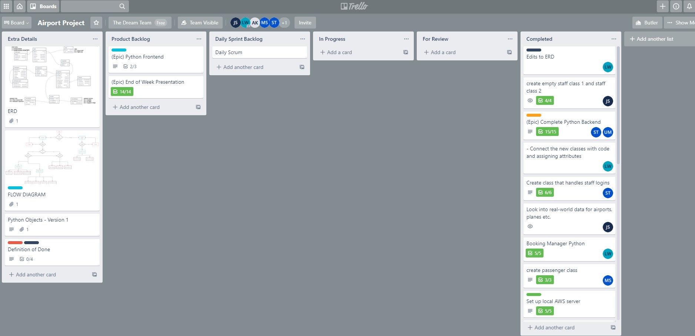
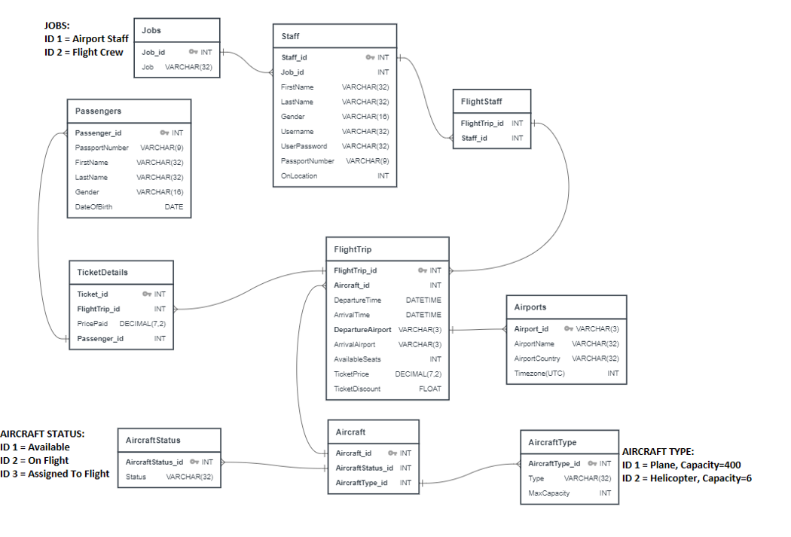

# Airport Project

Created by:
- [Leo Waltmann](https://github.com/ldaijiw)
- [Jared Solano](https://github.com/jaredsparta)
- [Sam Turton](https://github.com/samturton2)
- [Maciej Sokol](https://github.com/mattsokol79) 
- [Ubaid-ir-rehman Muhammad](https://github.com/ubaid97)

<br>
 
# Contents

1. [Introduction](#Introduction)
2. [Agile and Scrum](#Agile-and-Scrum)
3. [Database](#Database)
4. [Terminal UI with Python](#Terminal-UI-with-Python)

<br>

## Introduction

In this project we were tasked to design a flight trip booking system for airport staff and create a user-friendly Terminal UI. We were given a list of user stories that outlined the basic requirements for the product. The specification detailed that staff using the UI should be able to:
- Create a new Passenger using their basic personal information such as a name and passport number
- Create a flight trip with a specific destination
- Assign and/or change a plane to a given flight trip
- Login to perform any necessary actions
- Add passengers to a flight trip, and sell tickets to them
- Generate a flight attendees list detailing a passenger's name and passport number for a given flight 

We also added the following features as an increment after delivering the initial product:
- Ability for passengers to log in (once their details have been added to the database) and view available flights, as well as their current flight details (if a booking has been made in their name)
- Encryption of the login details for both staff and passengers in the database
- Added a hierarchy of staff with 2 levels: level 1 having restricted access, and level 2 having unrestricted access to all functions
- Ability for staff level 2 to find total profit made for a given flight trip
- Began a front-web application to create an intuitive way to perform the methods outlined by the initial requirements.

<br>

### Tech Stack and methodologies

For this project we used the following tech stack:
- Python
- Python Flask
- SQL
- HTML

We also implemented the following alongside these:
- Test Driven Development
- AWS Relational Database Service (RDS)

<br>

## Agile and Scrum

- As a group we decided to use the Scrum framework to implement Agile, with a focus on the continuous delivery of smaller incremental changes. 
    - Rather than planning out the entire week, we created a product backlog outlining the user stories and potential additional features as epic stories 
    - We used a scrum board created via [Trello](https://www.trello.com/en) to track our progress
    - We planned out daily sprints, starting with sprint planning meetings and ending with sprint retrospectives, which enabled us to be flexible and constantly reassess and reprioritise work as required

- Here was our Trello board, pictured after the completion of the project:

    

<br>

## Database

- A main point of the project was to design a database in which the Airport would store their data

### Where was the data stored?
- To ensure each of us were working with the same data at all times, we made use of the RDS service found on AWS

- We set up a SQL database on the cloud and we would connect to it via `pyodbc` or `Azure Data Studio`
    - This gave us an easy way to collaborate with one another and test code more efficiently 

### Entity Relationship Diagram

- We used ERD diagrams to help us in the designing of the database
    - Using diagrams, each of us would have a very clear vision of how our app would connect to our database, thus reducing bugs and errors
    - It allowed us to create optimal SQL scripts to ensure the database was seeded how we wanted it to be
    - Do look through `images/` to see how our ERD diagram evolved as more discussion and thought was put into it. There were several designs before we landed on the one shown here



### Seeding the database
- To test properly, we needed data that was already present in the database. Hence we created SQL files to seed the database for use

- We made use of a random data generator called [mockaroo](https://www.mockaroo.com/)
    - The SQL files holding the mock data can be found in `SQL/`
    - Inside, there are files with SQL DDL and DML statements for use in software like `Azure Data Studio`
    - There are also Python files that populate the database using `pyodbc` 

<br>

## Terminal UI with Python
- We implemented OOP when creating the terminal UI
    - This enabled us to implement the DRY principal more effectively
    - It also allowed us to efficiently build atop previously written code

- The terminal UI represented a way for staff and passengers at the airport to be able to do what they needed to do, as outlined previously in the `Introduction`

- We created four main classes for the UI:
    1. `LogIn` found in `classes/login.py` was the base class, which would be the first page of the UI
    2. `Passenger` found in `classes/passenger_ui.py` handles all the options for passengers
    3. `StaffUI_1` found in `classes/staff_ui.py` handled all the options for staff level 1
    4. `StaffUI_2` found in `classes/staff_ui.py` handled all the options for staff level 2

### Git
- Git was used as our Version Control System

- Our main methodology when working as a team using Git was:
    1. Create new branches when working on a new feature
    ```git branch <new_branch>```
    2. Switch to that branch whenever you were making changes to that feature
    ```git checkout <new_branch>```
    3. Add, commit and push your changes on that branch to GitHub
    ```git push -u origin <new_branch>```
    4. On GitHub, create a pull request for others to look at
    5. Discuss and accept the pull request if safe to do so
    6. Delete the old branch locally
    ```git branch -d <branch_to_delete>```

<br>
